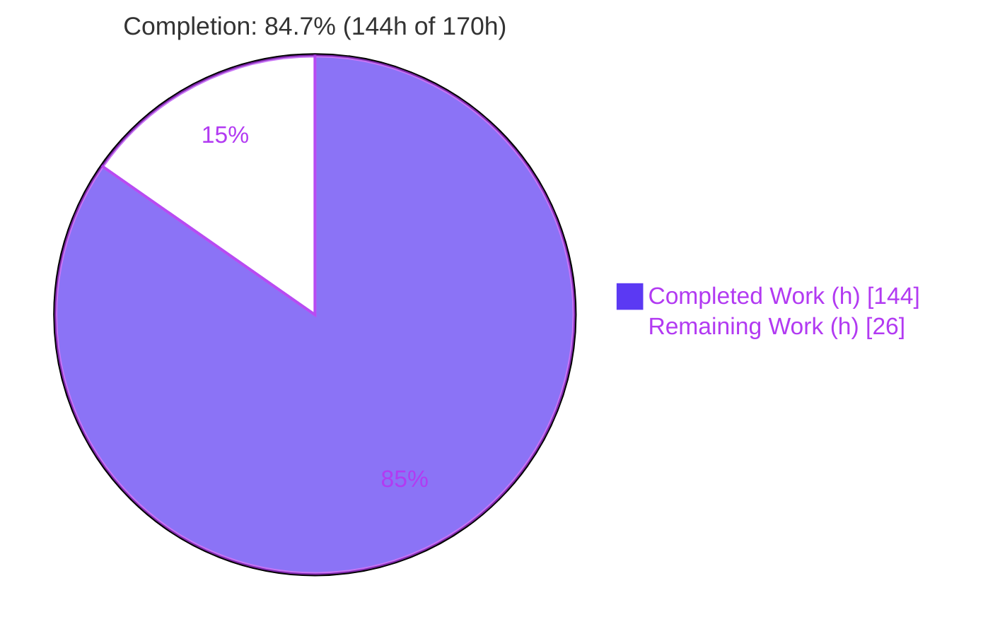
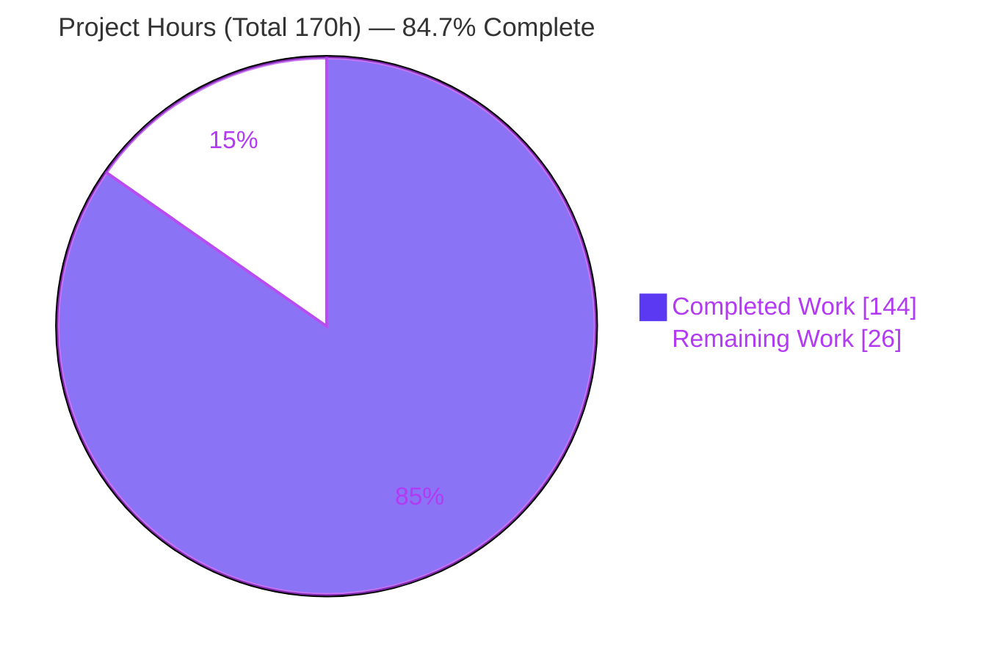
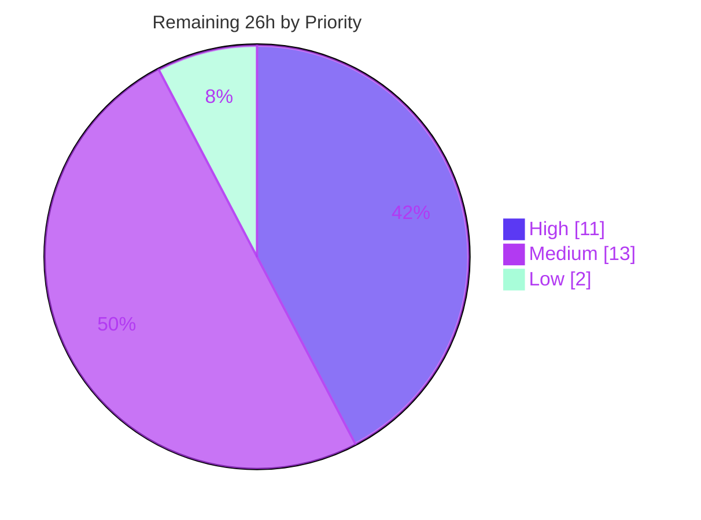

# Blitzy Project Guide — `iso20022-cbpr` (CBPR+ SR2026 Validation & MT→MX Address Migration)

> Brand legend used throughout this guide: **Completed / AI Work = Dark Blue `#5B39F3`**, **Remaining / Not Completed = White `#FFFFFF`**, Headings/Accents = Violet-Black `#B23AF2`, Highlight = Mint `#A8FDD9`.

---

## 1. Executive Summary

### 1.1 Project Overview

The **`iso20022-cbpr`** module adds **CBPR+ Standards Release 2026 compliance validation** and **address-scoped MT→MX migration** to the Prowide ISO 20022 library — an open-source Java library used by banks and fintech providers to build and parse ISO 20022 payment messages. It targets the SWIFT **14 November 2026 structured-address mandate**, validating `pacs.008.001.08`, `pacs.009.001.08`, and `pain.001.001.09` against 21 rule applications, and migrating party/postal-address data from legacy MT103/MT202/MT101 messages into their MX equivalents. The work delivers — as owned, auditable, tested code — message-level validation previously available only through the commercial Prowide Integrator product. It is a purely **additive, self-contained** module.

### 1.2 Completion Status



**Overall completion: `84.7%`** — computed strictly on AAP-scoped + path-to-production hours: `144 ÷ (144 + 26) = 144 ÷ 170 = 84.7%`.

| Metric | Hours |
|---|---|
| **Total Hours** | **170** |
| **Completed Hours (AI + Manual)** | **144** |
| &nbsp;&nbsp;• AI (autonomous Blitzy agents) | 144 |
| &nbsp;&nbsp;• Manual (human) | 0 |
| **Remaining Hours** | **26** |

> 100% of the AAP **feature** scope is delivered and independently verified green (455/455 tests). The remaining 26h is entirely **path-to-production** (human review, sign-off, release, integration) — there are no outstanding feature-implementation gaps.

### 1.3 Key Accomplishments

- ✅ New Gradle module `iso20022-cbpr` created and wired centrally (only 2 pre-existing files touched: `settings.gradle`, root `build.gradle`).
- ✅ `CbprValidator.validate(AbstractMX)` entry point implementing the **never-throw** + **collect-all-findings** contract with two-layer defensive error handling and sanitized logging.
- ✅ **21 rule applications / 12 distinct rule IDs** implemented as one explicit class per rule (9 pacs.008 + 7 pacs.009 + 5 pain.001) — zero omissions, verified by a rule-to-method coverage table.
- ✅ Hero rule `structured-address-min-town-country` with a shared `PostalAddressClassifier` (Structured / Hybrid / Unstructured), reused identically across all message types and party/agent occurrences.
- ✅ Three address-scoped migrators (`Mt103ToPacs008`, `Mt202ToPacs009`, `Mt101ToPain001`) + `AddressMigrationSupport`, using only the MT API REFERENCE, producing partial-by-design MX.
- ✅ Header reuse via `BusinessAppHdrV02` (composition + downcast) — **no `iso20022-core` extension point required**.
- ✅ 11 test classes / **88 tests** (455/455 including the 367 pre-existing core tests, all green), 34 fixtures, and 5 markdown design deliverables (A1–A4 investigations + pre-implementation analysis + final summary).
- ✅ Constraints honored: generated models consumed read-only, `pw-swift-core` source not ingested, Java 11 only, **no new dependencies / no version bumps**, existing build stays green.

### 1.4 Critical Unresolved Issues

| Issue | Impact | Owner | ETA |
|---|---|---|---|
| _None — no blocking or release-critical issue._ All AAP deliverables are implemented, compile cleanly, and pass 455/455 tests. | None | — | — |

> The items below in §1.6 and §2.2 are **path-to-production activities and recommended sign-offs**, not defects or blockers.

### 1.5 Access Issues

| System/Resource | Type of Access | Issue Description | Resolution Status | Owner |
|---|---|---|---|---|
| — | — | **No access issues identified.** The build resolves all dependencies (project + Maven Central) and runs fully offline against the local cache; no credentials, network services, or datastores are required. | N/A | — |

### 1.6 Recommended Next Steps

1. **[High]** Complete senior **code review & PR approval** of the `iso20022-cbpr` module (one-class-per-rule fidelity, never-throw contract, read-only model consumption, address-scoped migration).
2. **[High]** Obtain a **payments-SME rule-fidelity sign-off** confirming the encoded 21 rule applications and hero-rule semantics match live SWIFT CBPR+ SR2026 usage guidelines before production go-live.
3. **[Medium]** Make the **release/packaging decision**: bump version from `0.1.0-SNAPSHOT`, add a CHANGELOG entry, and decide whether to bring `iso20022-cbpr` under the Spotless formatter gate (currently scoped to `iso20022-core` only) or formally document the exclusion.
4. **[Medium]** Perform **downstream host integration** and a production-representative smoke test against real anonymized MX/MT samples.
5. **[Medium]** Run the **MT-capability gap acceptance review** documented in `migration_report.md` to confirm no gap affects the target production flows.

---

## 2. Project Hours Breakdown

### 2.1 Completed Work Detail

| Component | Hours | Description |
|---|---:|---|
| Module build wiring & registration | 2 | `settings.gradle` `include 'iso20022-cbpr'` + root `build.gradle` `project(':iso20022-cbpr')` dependency block (api core; implementation model-pacs/pain -mx/-types; test deps). |
| Validator core | 10 | `CbprValidator` (typed `instanceof` dispatch, never-throw, collect-all, sanitized logging), `ValidationResult` (valid = no ERROR), `Finding` (ruleId/severity/elementPath/message). |
| Shared support helpers | 16 | `Severity`, `CbprRule<T>` contract, `PostalAddressClassifier` (A3 typed inspection), `BicValidator` (ISO 9362), `FinXCharset` (FIN-X extended set). |
| pacs.008.001.08 rule classes (9) | 16 | StructuredAddress, PartyNameWhenAddressPresent, CreditorNameWhenNoAnyBic, PartyAnyBicExcludesNameAddress, BicfiFormat, AgentPointToPointBicfiMandatory, CharsetFinxExtended, InstructedAgentGroupVsTx, InterbankSettlementDatePresence. |
| pacs.009.001.08 rule classes (7) | 12 | StructuredAddress, FiPartyBicfiPreferred, BicfiFormat, AgentNationalClearingCodeOnly, InstructedAgentGroupVsTx, InterbankSettlementDatePresence, CharsetFinxExtended. |
| pain.001.001.09 rule classes (5) | 8 | StructuredAddress, PartyNameWhenAddressPresent, BicfiFormat, RelatedPresentWhenCopyDuplicate (reuses `BusinessAppHdrV02`), CharsetFinxExtended. |
| MT→MX migrators (4) | 18 | `Mt103ToPacs008`, `Mt202ToPacs009`, `Mt101ToPain001`, `AddressMigrationSupport` (F-field line-semantics → `PostalAddress24`). |
| Test suite (11 classes / 88 tests) | 28 | Per-rule negatives, hero pass/hybrid/unstructured, migration round-trips (incl. mandated unstructured-MT-fails-hero), helper unit tests. |
| Test fixtures (34) | 14 | 30 XML fixtures (compliant + per-rule negatives) + 4 MT `.txt` sources. |
| Documentation deliverables (5) | 14 | `pre_implementation_analysis`, `validation_design_report` (A1+A2), `structured_address_report` (A3), `migration_report` (A4), `final_summary` (~10,600 words total). |
| Debugging / traversal fixes / final validation | 6 | pacs.009 traversal fixes (PrvsInstgAgt, clearing-code country gate), pain.001 coverage-gap fix, exhaustive final validation. |
| **Total Completed** | **144** | Matches Completed Hours in §1.2. |

### 2.2 Remaining Work Detail

| Category | Hours | Priority |
|---|---:|---|
| Human code review & PR approval of the module | 6 | High |
| CBPR+ rule-fidelity SME sign-off vs live SWIFT SR2026 guidelines | 5 | High |
| Release/publishing & formatter-gate decision (version, CHANGELOG, Spotless/POM) | 4 | Medium |
| Downstream host integration + production-representative smoke test | 6 | Medium |
| MT-capability gap acceptance review (per `migration_report.md`) | 3 | Medium |
| Future message-type scope confirmation (pacs.004 / pain.008 deferral) | 2 | Low |
| **Total Remaining** | **26** | Matches Remaining Hours in §1.2 and §7. |

### 2.3 Hours Reconciliation

- **Completed (2.1) = 144h**, **Remaining (2.2) = 26h**, **Total = 170h**.
- Cross-section integrity: `2.1 + 2.2 = 144 + 26 = 170` = **Total Project Hours (§1.2)** ✔
- Completion: `144 / 170 = 84.7%` — used identically in §1.2, §7, and §8 ✔

---

## 3. Test Results

All tests below originate from **Blitzy's autonomous validation** and were **independently re-executed** for this guide via fresh `cleanTest test` runs; counts were parsed directly from the JUnit XML in `build/test-results/`.

| Test Category | Framework | Total Tests | Passed | Failed | Coverage % | Notes |
|---|---|---:|---:|---:|---:|---|
| Unit — shared helpers | JUnit 5 + AssertJ | 39 | 39 | 0 | — | `BicValidatorTest` 14, `FinXCharsetTest` 13, `PostalAddressClassifierTest` 12. |
| Validation — rules & dispatch | JUnit 5 + AssertJ + XMLUnit | 42 | 42 | 0 | — | `Pacs008ValidationTest` 11, `Pain001ValidationTest` 9, `CbprValidatorTest` 9, `Pacs009ValidationTest` 8, `Pacs009RuleTraversalTest` 5. |
| Migration — MT→MX | JUnit 5 + AssertJ | 7 | 7 | 0 | — | `Mt103ToPacs008Test` 3 (incl. mandated unstructured-fails-hero), `Mt202ToPacs009Test` 2, `Mt101ToPain001Test` 2. |
| **`iso20022-cbpr` subtotal** | **JUnit 5** | **88** | **88** | **0** | — | 0 skipped; 88 `@Test`/`@ParameterizedTest` = 88 executed (1:1). |
| `iso20022-core` regression | JUnit 5 | 367 | 367 | 0 | — | Pre-existing suite remains fully green (additive module did not break it). |
| **TOTAL** | | **455** | **455** | **0** | — | **0 failures, 0 errors, 0 skipped.** |

**Test integrity notes**

- No `@Disabled`/`@Ignore`/`assume*` anywhere — no blocked or skipped tests.
- **No mocking** (per the repository convention): real `Mx*`/`Mt*` domain objects are driven through the real JAXB runtime against real fixtures.
- Coverage % is shown as `—` because a per-module coverage tool (e.g., JaCoCo) was intentionally **not** run for the new module (coverage tooling is out of AAP scope). **Functional coverage is complete**: every one of the 21 rule applications has at least one firing (negative) test, the hero rule is exercised for structured (pass) / hybrid (pass) / unstructured (fail) cases, warnings are asserted as `WARNING` with the result staying valid, and the never-throw + collect-all contract is tested with null/malformed/empty inputs.

---

## 4. Runtime Validation & UI Verification

**UI Verification — Not Applicable.** Prowide ISO 20022 is a headless, embeddable Java library with **no web UI, desktop GUI, or CLI** (AAP §0.4.4, §7). The module's "interface" is the programmatic Java API `CbprValidator.validate(AbstractMX)` → `ValidationResult` plus the three migrators.

**Runtime health** — verified via an out-of-JUnit smoke program compiled against the module's runtime classpath (reproduced independently for this guide):

- ✅ **Operational** — `validate(pacs008_structured_address.xml)` → `valid=true`, hero rule **not** fired, `0` findings.
- ✅ **Operational** — `validate(pacs008_unstructured_address.xml)` → `valid=false`, hero rule fires: `ERROR structured-address-min-town-country` at `…/CdtTrfTxInf[0]/Cdtr/PstlAdr`.
- ✅ **Operational** — `new Mt103ToPacs008().translate(mt103_unstructured.txt)` → non-null partial `MxPacs00800108`; re-validation → hero rule **fires** (end-to-end proof an unstructured MT source fails the mandate).
- ✅ **Operational** — `new Mt103ToPacs008().translate(mt103_structured.txt)` → non-null partial MX; re-validation → hero rule **not** fired (residual non-address findings only, partial-by-design).
- ✅ **Operational** — `validate((AbstractMX) null)` → clean valid result; **did not throw** (core behavioral contract holds).

**API / integration outcomes**

- ✅ **Operational** — Dependency graph resolves fully: `:iso20022-core` (api) → `pw-swift-core:SRU2025-10.3.14` (transitive); `model-common-types` auto-added; `model-pacs/pain -mx/-types` (implementation); `commons-lang3:3.20.0`, `jaxb-impl:4.0.6` inherited.
- ✅ **Operational** — Full `./gradlew build` succeeds; the uber JAR `pw-iso20022-SRU2025-0.1.0-SNAPSHOT.jar` aggregates the module's classes.

---

## 5. Compliance & Quality Review

Compliance matrix mapping AAP deliverables and absolute constraints to their delivered status.

| # | AAP Deliverable / Constraint | Benchmark | Status | Progress |
|---|---|---|---|---|
| 1 | Module `iso20022-cbpr` created & centrally wired | 2 build edits only | ✅ Pass | 100% |
| 2 | `CbprValidator.validate(AbstractMX)` entry point | Signature + dispatch | ✅ Pass | 100% |
| 3 | 21 rule applications / 12 rule IDs, one class per rule | Zero omissions (coverage table) | ✅ Pass | 100% |
| 4 | Hero rule `structured-address-min-town-country` semantics | Structured/Hybrid pass; Unstructured fail; BIC-only exempt | ✅ Pass | 100% |
| 5 | Validator **never throws**, **collects all findings** | Null/malformed → findings, not exceptions | ✅ Pass | 100% |
| 6 | Three address-scoped migrators + support | Partial-by-design MX | ✅ Pass | 100% |
| 7 | End-to-end proof incl. unstructured-MT-fails-hero | Mandated negative migration test | ✅ Pass | 100% |
| 8 | Reuse `AppHdrParser`/`BusinessAppHdrV02` (no new header code) | Composition + downcast | ✅ Pass | 100% |
| 9 | Generated models consumed read-only | No `model-*` edits | ✅ Pass | 100% |
| 10 | `iso20022-core` unchanged (≤1 contingent extension) | No core edits (composition sufficed) | ✅ Pass | 100% |
| 11 | MT API REFERENCE only; `pw-swift-core` source not ingested | No new MT parser; gaps recorded | ✅ Pass | 100% |
| 12 | Java 11 only; no new deps / no version bumps | Clean Java 11 compile | ✅ Pass | 100% |
| 13 | Existing build stays green | 367 core tests pass | ✅ Pass | 100% |
| 14 | A1–A4 investigations + 5 markdown deliverables | Two-candidate analyses + coverage/gap tables | ✅ Pass | 100% |
| 15 | Formatter gate applied to new module | Spotless scoped to `iso20022-core` only | ⚠ By design (out of scope) | Decision pending (§2.2) |

**Fixes applied during autonomous validation:** pacs.009 rule traversal corrections (`PrvsInstgAgt1..3`, full address charset sweep, 0-based transaction index, clearing-code country gate) and a pain.001 rule coverage-gap fix; validator logging sanitized to avoid emitting untrusted content. **Outstanding compliance items:** none in code — only the human rule-fidelity sign-off (§1.6 #2) and the formatter-gate decision (row 15).

---

## 6. Risk Assessment

| Risk | Category | Severity | Probability | Mitigation | Status |
|---|---|---|---|---|---|
| cbpr not covered by repo Spotless/palantirJavaFormat gate (scoped to `iso20022-core` only) | Technical | Low | Medium | Add cbpr to Spotless scope or document intentional exclusion; confirmed applying it is a cosmetic-only 11-file delta (zero logic change) | Open (out-of-scope by design) |
| CBPR+ rules encoded at generation-time (no runtime interpreter, per mandate); future SR (SR2027+) requires code edits | Technical | Low | Medium | One-class-per-rule design makes extension straightforward; recorded as future work in `final_summary.md` | Accepted by design |
| Migrated MX are partial-by-design; a consumer could mistake them for wire-ready payments | Technical | Medium | Low | Extensively documented in `migration_report.md` + Javadoc; tests assert only on structured-address findings | Mitigated / documented |
| XML parsing of untrusted message content (XXE) | Security | High (if unmitigated) | Low | Inherits Prowide Core `SafeXmlUtils` XXE-safe parsing via the existing parse path; introduces no new parser; validator logging is sanitized (no stack traces / untrusted content) | Mitigated (inherited) |
| Input hardening of payment data | Security | Low | Low | BICFI + FIN-X charset rules act as input-hardening checks; no new network/filesystem/reflection surface | Mitigated by design |
| Module `0.1.0-SNAPSHOT`, not yet released; no CHANGELOG entry | Operational | Medium | High | Release/publishing decision (§2.2) | Open (path-to-production) |
| No cbpr-specific CI job beyond the aggregate build (Jenkinsfile untouched per scope) | Operational | Low | Low | Aggregate `./gradlew build` already includes cbpr in the reactor | Low / monitored |
| MT-capability gaps recorded (not invented) in `migration_report.md` | Integration | Medium | Medium | Gap-acceptance review (§2.2) to confirm no impact on target flows | Open (documented gaps) |
| `CbprValidator` not yet wired into a host application | Integration | Medium | High | Downstream integration + production-representative smoke test (§2.2) | Open (path-to-production) |
| Rule fidelity vs live SWIFT CBPR+ SR2026 guidelines | Integration / Compliance | Medium-High (regulatory) | Low | Faithfully encodes AAP's authoritative verbatim rule table; payments-SME sign-off recommended pre-production (§1.6 #2) | Open (recommended sign-off) |

**Overall risk posture: LOW–MEDIUM.** No High-severity **open** risk exists in the delivered code (the XXE risk is mitigated by inheritance). Every open item is a path-to-production/human-process activity already reflected in the 26h remaining. No unresolved compilation/test failures; no vulnerable-dependency additions (zero new dependencies).

---

## 7. Visual Project Status

### 7.1 Project Hours Breakdown



> Integrity check: pie "Remaining Work" = **26** = §1.2 Remaining Hours = §2.2 total. Pie "Completed Work" = **144** = §1.2 Completed Hours = §2.1 total.

### 7.2 Remaining Hours by Priority



### 7.3 Remaining Hours by Category (bar-style breakdown)

| Category | Hours | Bar |
|---|---:|---|
| Downstream host integration + smoke test | 6 | ██████ |
| Human code review & PR approval | 6 | ██████ |
| CBPR+ rule-fidelity SME sign-off | 5 | █████ |
| Release/publishing & formatter-gate decision | 4 | ████ |
| MT-capability gap acceptance review | 3 | ███ |
| Future message-type scope confirmation | 2 | ██ |
| **Total** | **26** | |

---

## 8. Summary & Recommendations

**Achievements.** The project delivers a complete, production-grade `iso20022-cbpr` module implementing both mandated capabilities: CBPR+ SR2026 validation (21 rule applications / 12 rule IDs across three message types, with the hero structured-address rule) and address-scoped MT→MX migration (three flows + shared support). The work is **purely additive** — 83 files added, 2 modified, 12,883 insertions, 0 deletions — with **zero out-of-scope changes** to any generated model module or to `iso20022-core`. The validator's core contract (**never throws, collects all findings**) is implemented defensively and tested; migration proves compliance end-to-end, including the mandated unstructured-MT case that fails the hero rule.

**Overall completion: `84.7%` (144h of 170h).** This reflects that **100% of the AAP feature scope is delivered and independently verified green** (455/455 tests, clean Java 11 compile, full build green), while **26h of path-to-production work remains** — none of it feature-implementation.

**Remaining gaps & critical path to production.** The critical path is human/process, not engineering: (1) senior code review & PR approval; (2) payments-SME rule-fidelity sign-off against live SWIFT CBPR+ SR2026 guidelines (regulatory 14 Nov 2026 mandate); then (3) release/packaging decision, (4) downstream host integration + smoke test, and (5) MT-gap acceptance review.

**Success metrics.**

| Metric | Result |
|---|---|
| AAP feature deliverables implemented | 100% |
| Tests passing | 455 / 455 (0 skipped) |
| Rule applications covered (1 class + ≥1 test each) | 21 / 21 |
| Out-of-scope files changed | 0 |
| New dependencies / version bumps introduced | 0 |
| Net lines changed | +12,883 / -0 |

**Production readiness assessment.** **Conditionally ready.** The code is production-grade and fully validated; it is ready to enter human review and the release pipeline. Recommended gating conditions before go-live: payments-SME rule-fidelity sign-off and completion of the release/packaging decision. No code fixes are required to proceed.

---

## 9. Development Guide

### 9.1 System Prerequisites

- **JDK 11** (build/test verified on OpenJDK `11.0.31`). Source and target are Java 11; no JDK 17+ features are used. A newer JDK is **not** required and Java 17+ language features must not be introduced.
- **Gradle 8.14.5** — bundled via the wrapper (`./gradlew`); no separate Gradle install needed.
- **~7 GB** of available heap for the full multi-module build.
- **Network:** Maven Central reachable on first build to download dependencies (cached thereafter; subsequent builds run offline).
- **OS:** any Unix-like environment or Windows (use `gradlew.bat`).

### 9.2 Environment Setup

```bash
# From the repository root
git rev-parse --abbrev-ref HEAD      # expect: blitzy-24cfbb54-0289-4c95-b382-f14761f165fc
java -version                        # expect: openjdk 11.x
./gradlew --version                  # expect: Gradle 8.14.5
```

> **Memory note:** `gradle.properties` is `.gitignored`, so the JVM heap is **not** preconfigured. Pass memory on the command line (see below). No environment variables, secrets, or external services are required — this is a headless library with no datastore or network I/O.

### 9.3 Dependency Installation

Dependencies are resolved automatically by Gradle from the central root `build.gradle`. To inspect the module's compile classpath:

```bash
./gradlew :iso20022-cbpr:dependencies --configuration compileClasspath --no-daemon
```

Expected (abridged): `project :iso20022-core` → `com.prowidesoftware:pw-swift-core:SRU2025-10.3.14`; `project :model-common-types` (auto-added); `project :model-pacs-mx/-types`, `project :model-pain-mx/-types`; `org.apache.commons:commons-lang3:3.20.0`; `com.sun.xml.bind:jaxb-impl:4.0.6`.

### 9.4 Build & Test

```bash
# Build just the new module
./gradlew :iso20022-cbpr:build --no-daemon -Dorg.gradle.jvmargs="-Xms512m -Xmx7g"

# Run just the new module's tests (88 tests)
./gradlew :iso20022-cbpr:test --no-daemon -Dorg.gradle.jvmargs="-Xms512m -Xmx7g"

# Force a fresh test run (bypass the up-to-date cache)
./gradlew :iso20022-cbpr:cleanTest :iso20022-cbpr:test --no-daemon -Dorg.gradle.jvmargs="-Xms512m -Xmx7g"

# Full multi-module regression build (AAP-mandated; existing build must stay green)
./gradlew build --no-daemon -Dorg.gradle.jvmargs="-Xms512m -Xmx7g"
```

**Expected output:** `BUILD SUCCESSFUL`; the cbpr module reports **88 tests, 0 failures**; the full build reports all modules green (455 tests including core).

### 9.5 Verification Steps

- Test report (HTML): `iso20022-cbpr/build/reports/tests/test/index.html`
- JUnit XML (machine-readable): `iso20022-cbpr/build/test-results/test/*.xml`
- Uber JAR (after full build): `build/libs/pw-iso20022-SRU2025-0.1.0-SNAPSHOT.jar` — confirm it contains the cbpr classes:

```bash
unzip -l build/libs/pw-iso20022-SRU2025-0.1.0-SNAPSHOT.jar | grep -c 'com/prowidesoftware/swift/cbpr/'
```

### 9.6 Example Usage

```java
import com.prowidesoftware.swift.cbpr.*;
import com.prowidesoftware.swift.model.mx.AbstractMX;
import com.prowidesoftware.swift.model.mx.MxPacs00800108;

// --- Capability A: validate an MX message ---
AbstractMX mx = AbstractMX.parse(xmlString);           // e.g., a pacs.008.001.08
ValidationResult result = new CbprValidator().validate(mx);
if (!result.isValid()) {                               // valid == no ERROR-severity finding
    result.getFindings().forEach(f ->
        System.out.println(f.getSeverity() + " " + f.getRuleId() + " @ " + f.getElementPath()));
}

// The validator never throws — a null or malformed message yields a clean/aggregated result:
ValidationResult safe = new CbprValidator().validate((AbstractMX) null); // valid, no exception

// --- Capability B: migrate a legacy MT and re-validate ---
MxPacs00800108 migrated = new Mt103ToPacs008().translate(mt103Fin);      // partial-by-design MX
ValidationResult after = new CbprValidator().validate(migrated);         // assert on hero-rule findings
```

**Verified behavior** (run outside JUnit against the module runtime classpath):
`structured → valid=true, 0 findings` · `unstructured → valid=false, hero rule ERROR fired` · `null → valid=true (no throw)`.

### 9.7 Troubleshooting

- **`OutOfMemoryError` during the full build** → always pass `-Dorg.gradle.jvmargs="-Xms512m -Xmx7g"` (heap is not preconfigured because `gradle.properties` is gitignored).
- **"Deprecated Gradle features … incompatible with Gradle 9.0" warning** → benign, pre-existing build-tooling notice (unchanged per scope); it is **not** a cbpr error and does not affect the build result.
- **Edit to a generated file rejected** → a repository pre-edit hook (`.claude/hooks/block-generated.sh`) blocks writes to any `*/src/generated/*` path; generated models are regenerated from XSD, never hand-edited.
- **`IllegalArgumentException` from a migrator** → the migrators enforce a caller contract and throw on `null`/unparseable/non-matching MT input; wrap calls accordingly. Note this is distinct from the **validator**, which never throws.
- **`spotlessCheck` and the cbpr module** → Spotless is scoped to `iso20022-core` only; the cbpr module is intentionally ungated (a release-time decision, see §2.2).

---

## 10. Appendices

### A. Command Reference

| Command | Purpose |
|---|---|
| `./gradlew :iso20022-cbpr:build -Dorg.gradle.jvmargs="-Xms512m -Xmx7g"` | Build the module. |
| `./gradlew :iso20022-cbpr:test -Dorg.gradle.jvmargs="-Xms512m -Xmx7g"` | Run the 88 module tests. |
| `./gradlew :iso20022-cbpr:cleanTest :iso20022-cbpr:test` | Force fresh test execution. |
| `./gradlew build -Dorg.gradle.jvmargs="-Xms512m -Xmx7g"` | Full multi-module regression build. |
| `./gradlew :iso20022-cbpr:dependencies --configuration compileClasspath` | Inspect the compile classpath. |
| `git diff --stat origin/main..HEAD` | Review the full change set. |

### B. Port Reference

**Not applicable.** The library performs no network I/O and exposes no ports, endpoints, or services.

### C. Key File Locations

| Path | Contents |
|---|---|
| `iso20022-cbpr/src/main/java/com/prowidesoftware/swift/cbpr/` | Validator core + 5 shared helpers. |
| `…/cbpr/rules/pacs008/` · `…/pacs009/` · `…/pain001/` | 9 + 7 + 5 = 21 rule classes. |
| `…/cbpr/migration/` | `Mt103ToPacs008`, `Mt202ToPacs009`, `Mt101ToPain001`, `AddressMigrationSupport`. |
| `iso20022-cbpr/src/test/java/com/prowidesoftware/swift/cbpr/` | 11 test classes (88 tests). |
| `iso20022-cbpr/src/test/resources/` | 34 fixtures (30 XML + 4 MT `.txt`). |
| `iso20022-cbpr/docs/` | 5 markdown deliverables (A1–A4 + pre-implementation + final summary). |
| `settings.gradle` (line 4) | `include 'iso20022-cbpr'`. |
| `build.gradle` (line 212) | `project(':iso20022-cbpr') { … }` dependency block. |

### D. Technology Versions

| Component | Version |
|---|---|
| Java (source/target) | 11 |
| Gradle (wrapper) | 8.14.5 |
| Prowide Core (`pw-swift-core`) | SRU2025-10.3.14 (transitive via `iso20022-core`) |
| JAXB impl (`com.sun.xml.bind:jaxb-impl`) | 4.0.6 |
| `commons-lang3` | 3.20.0 |
| `gson` | 2.14.0 |
| JUnit Jupiter | 5.11.4 |
| AssertJ | 3.27.7 |
| XMLUnit | 2.12.0 |
| Guava (test) | 33.6.0-jre |
| Module version | `SRU2025-0.1.0-SNAPSHOT` |

### E. Environment Variable Reference

**None required.** The module needs no environment variables, credentials, or external configuration. The only runtime knob is the Gradle JVM heap, supplied via `-Dorg.gradle.jvmargs="-Xms512m -Xmx7g"` (because `gradle.properties` is gitignored).

### F. Developer Tools Guide

| Area | Guidance |
|---|---|
| Generated models | Never hand-edit `*/src/generated/*`; a pre-edit hook blocks it. Regenerate from XSD per SRU. |
| Formatting | `iso20022-core` is gated by Spotless/palantirJavaFormat; `iso20022-cbpr` is currently ungated (release-time decision pending). |
| Testing convention | JUnit 5 + AssertJ + XMLUnit, **no mocking** — exercise real domain objects against real fixtures. |
| Adding a future rule | Add one class under the appropriate `rules/<msg>/` subpackage with a single public `check(...)`, register it in the validator's rule list, and add a negative fixture + test. |

### G. Glossary

| Term | Definition |
|---|---|
| **CBPR+** | Cross-Border Payments and Reporting Plus — the market practice for ISO 20022 cross-border payments over SWIFT. |
| **SR2026** | SWIFT Standards Release 2026, the vehicle for the 14 Nov 2026 structured-address mandate. |
| **Hero rule** | `structured-address-min-town-country` — postal address must be Structured or Hybrid; fully-unstructured fails. |
| **Structured / Hybrid / Unstructured** | Structured = `TwnNm`+`Ctry`, no `AdrLine` (pass); Hybrid = `TwnNm`+`Ctry` + ≥1 `AdrLine` (pass); Unstructured = `AdrLine` with `TwnNm` or `Ctry` missing (fail). |
| **MX / MT** | MX = ISO 20022 XML messages (e.g., pacs.008); MT = legacy SWIFT FIN messages (e.g., MT103). |
| **Partial-by-design** | A migrated MX populated only with debtor/creditor identity + postal-address fields; other branches deliberately left null. |
| **Finding** | A single rule outcome (`ruleId`, `severity`, `elementPath`, `message`) collected into a `ValidationResult`. |
| **BAH / `BusinessAppHdrV02`** | Business Application Header (CBPR+ default BAH_V2), reused for the pain.001 CopyDuplicate rule. |

---

*Cross-section integrity verified prior to submission: Remaining hours = **26** in §1.2, §2.2, and §7; §2.1 (144) + §2.2 (26) = **170** = §1.2 Total; completion **84.7%** consistent across §1.2, §7, §8; all Section 3 tests originate from Blitzy's autonomous validation logs; brand colors applied (Completed `#5B39F3`, Remaining `#FFFFFF`).*